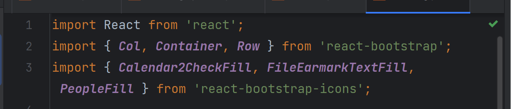

## Importance of Coding Standards
What if I wrote this whole essay in a single line? No headers, no spacing between paragraphs, and no font differences. It would be really hard to tell where one paragraph starts and ends. My words will appear to be tangled together and reflect a "careless" attitude towards this piece of writing. Without enforcing any kind of format standard, readability would be negatively affected and this is applied to program writing as well. We have coding standards that allow for code to be structured in a way that a large population can easily read others' code. By providing standards, we are enforcing consistency and this is what keeps a project "neat." When a project is written with a consistent style, professionalism is practiced and enables readers to realize an aesthetic style that enables smooth reading. ESLint is a popular tool that ensures that the syntax resembles the basic style often showcased in beginner-level courses. For example, keeping a function's opening bracket on the same line as the function declaration and the closing bracket at the same indentation level some lines down. As argued once, coding standards can help in learning a new language. To learn anything new, at the very base of it, we must read about it. Being given material broken into sections, it is less overwhelming and gives clear distinctions between different topics. As with coding standards, we are able to focus on particular sections of the code because there are visible separations in place. 

## The Green Check
After resolving all of the format issues, a green check mark will appear on the top right side of IntelliJ. A sense of validation and satisfaction envelopes the writer. It's strange how a small icon can bring one so much joy and accomplishment. Since it represents a "stamp of approval" for writing code that passes the standards of ESLint, there is an underlying achievement that may or may not be conscious to the writer. That is, their code will satisfy a large population (those in the ESLint community) when it comes to the visual aspect. It's almost as if there is no shame in sharing your code with peers, even if the logic may not be the best. I feel like this is because even though the logic may not "make sense," you are ensured that your readers will understand what you are trying to do just because the style of writing is a familiar format.

## Personal Usage
It's important to me to see the urgent calls and fixes if I really want to change my style of writing. With this feature in the IntelliJ "problems" tab and the numerous red squiggly lines, I won't be able to continue writing the code until all have been resolved. This way, it brings about a desire to write in a clear manner with the "right" syntax. After installing ESLint for the last few assignments, I've caught myself correcting my own writing before the syntax complaints occur. I can tell that I've adjusted my own writing and see to it that I prefer the format that ESLint enforces. I'm glad to have come across this coding style as I believe it serves as a reminder that I should assume my code will be read by peers. Professionalism will be apparent in my future projects in terms of coding style which ESLint promotes and is therefore judged to be very useful and beneficial.
