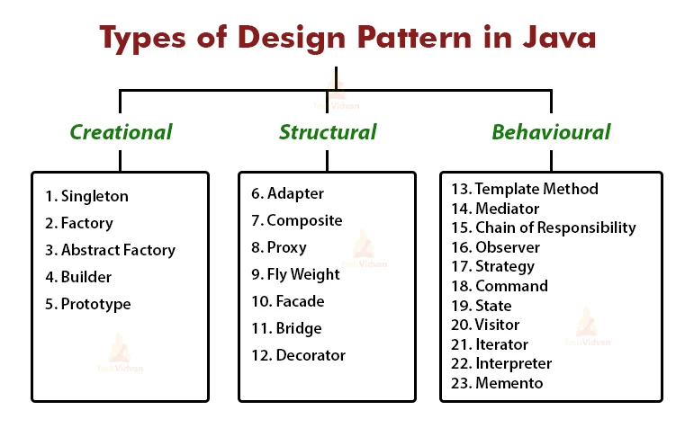

## The importance of patterns
Patterns enable quick learning as there is a general behavior that can be applied to specific cases. Being able to build projects using patterns allows for scalability and flexibility. New contributors will be able to recognize and utilize previous work so as not to be re-solving common problems already fixed. Not only do patterns allow beginners to initially replicate an artificial understanding of a project, but will also allow them to begin working on the project quickly. The best way to learn is to do it yourself and following a pattern gives a solid excuse for why one may approach an issue the way they did. Of course, in the field of Software Engineering, pattern recognition is a vital skill to have if one wants to succeed. This is because it is expected that one is able to build or modify features that rely on previous features. It's helpful to use pattern recognition when approaching similar issues, i.e., recognizing a typical solution for recurring issues. By implementing design patterns for a project, developers will have a structure to follow and refer to when approaching an issue. There are several design patterns in this field that each have their own benefits and are often categorized into three sections: creational, structural, and behavioral. These patterns, generally speaking, is the object-orientated programming (OOP) concept that I find to be relevant and important for all projects I've contributed to.

## Patterns in the workplace
As stated earlier, pattern recognition is a vital skill for software developers. OOP is a style of programming that can fulfill the three categories of design patterns. With OOP, an object is able to be created, structured, and behave the same way that other objects in the same class are/do. Obviously, this would mean for pattern recognition to be straightforward as the developer will only need to read the class file and the way objects of the class have been implemented to solve certain issues. This is exactly how I came to solve various issues in my current position as a Web App Developer. We use Java so that OOP can be enforced and encouraged because our team understands the importance of incorporating this programming style. I appreciate using this style often because it has been very helpful for me when finding examples of how a feature has been implemented on the project. This allows me to use this pattern and cater it to some particular issue I'm pursuing. Doing so saves me a lot of time from doing unnecessary research into how to approach the problem and also keeps consistency in our codebase. This, eventually, will solidify as a prime example for a future employee who doesn't know where to begin since there are numerous ways of approaching the same problem in Software Development. 
