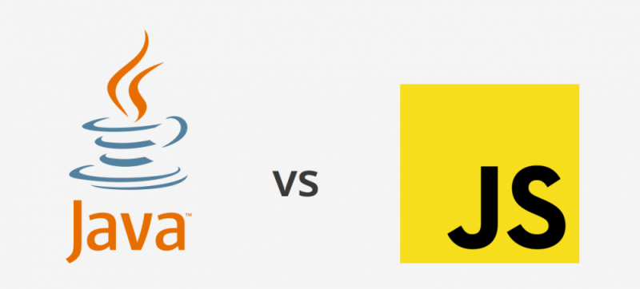

*Javascript is magic*

Please don't exit this page if you swear by TypeScript. This is solely my experience stepping into the world of website development where Javascript happens to be the language I'm using as an introduction to the field. Up until recently, I've been immersed in using Java and therefore accustomed to looking at lengthy references to some data.

## Coming from Java
Java is my first programming language. There's love for when one is trying to learn a new language. I didn't feel as though there was a major learning curve because the code is readable with little to no prior coding experience. In my case, I had no previous experience coding going into college. I also adopted the object-orientated programming concept easily as it just "made sense" when it comes to how a new object should be created. By "made sense," I'm referring to object inheritance where a class is able to adopt properties from another since I have a "bottom-up" thinking sense. However, without being on a project since the beginning, it will be confusing to outsiders as they aren't aware of all the named methods being used. For example, my student web app development team uses Java and I felt overwhelmed, when I first started, with how many functions were being referred to in a single method.

## Significant differences
Javascript brings about really convenient features that would otherwise be considered impossible in Java. A significant difference is due to the fact that Javascript will treat functions as objects which enables the writer to pass in functions as parameters and other manipulations that aren’t available with Java. I appreciate this ability to treat functions as another object as I've only ever heard this concept a couple of times from my professor in the introductory courses. In-line functions are another feature that amazed me as I went through the FreeCodeCamp tutorial. This feature can benefit software developers because it will condense the code writing so that the writer doesn’t have to feel overwhelmed by too many lines, as I feel about Java sometimes. As you have probably figured out, this is why I described Javascript to be "magic." The astonishing simplification of code to do the same functionality has me pondering about other languages that consider functions as "first-class."

## Future uses
Given that I've had a positive experience learning Javascript, there's a high chance that I will grow my professional career with Javascript as a sturdy and reliable tool/skillset. There may be many other languages that are arguably "better" than Javascript but, at least at this stage of my education, I'd like to focus on expanding my knowledge in Javascript when it comes to website development. 
