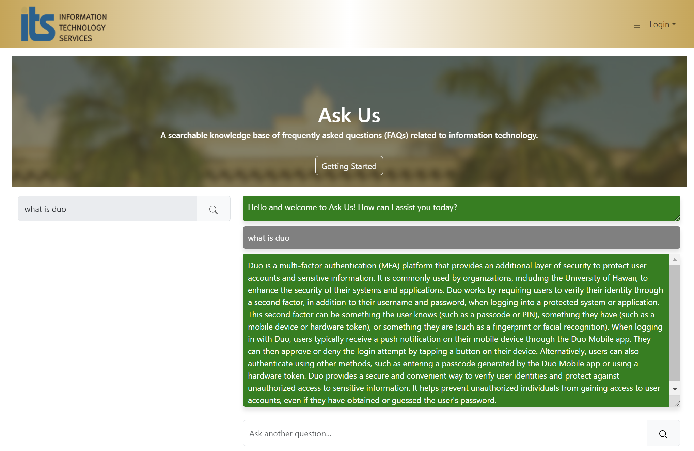

This project was created as a result of the prompt for the 2023 HACC University of Hawaii ITS department. The goal was to create an AI chatbot that allows users to conveniently ask their technical questions related to using any of the ITS products. We were given numerous articles that the ITS website has published and tasked to use the information to hydrate the AI with. We ended up choosing to use OpenAI, Pinecone (for the embeddings), and MongoDB. 

I was responsible for implementing our "Related Article Links" feature. This is seen after each response that referenced particular articles that passed a certain threshold, in terms of "scoring." If these articles would be greater than the threshold, the article link(s) will be provided for easy access to the user if they'd like to read about the topic themselves. This is an important and significant feature as this shows the reliability of the AI-generated answer because it is based off of ITS published articles. Aside from this feature, I also ensured external links were working properly on the page (EX: to the ITS News site) and enabled an optional feedback page for our team. I believe that receiving feedback from the general public is an important aspect as the project can be more catered to the groups of consumers that use the site the most.

This project allowed me to explore how to implement an AI model and a database into a project which involves key usages, article parsing, and database queries. This project also allowed me to further explore Meteor and React components to build the visual aspects of the page. My team and I used a GitHub project board as a way to easily and visually communicate to each other which tasks were being worked on. I was also able to practice my written communication skills in order to relay information without causing much confusion.

Source: <a href="https://github.com/tryRebooting2023/askus"><i class="large github icon"></i>Github Repo for tryRebooting2023/askus</a>

Deployed site: <a href="https://askusits.site/">AskUs</a>
