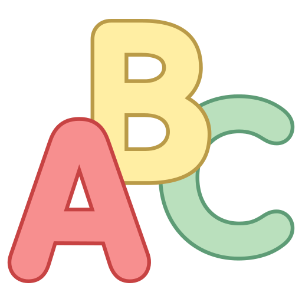

This was an independent assignment that takes some input (whether it be .txt format or manually typed into the command line) and counts the number of occurrences of the letters: 'a', 'b', and 'c'. I had to use the `getchar()` method that will take in the value of the next character from the input. 

Helped to get accustomed to how to use `getchar()` and using the C syntax (for printing out) after having spent two semesters focusing on the Java language.

Source: <a href="https://github.com/michho8/counting-chars"><i class="large github icon "></i>ics212-counting</a>
