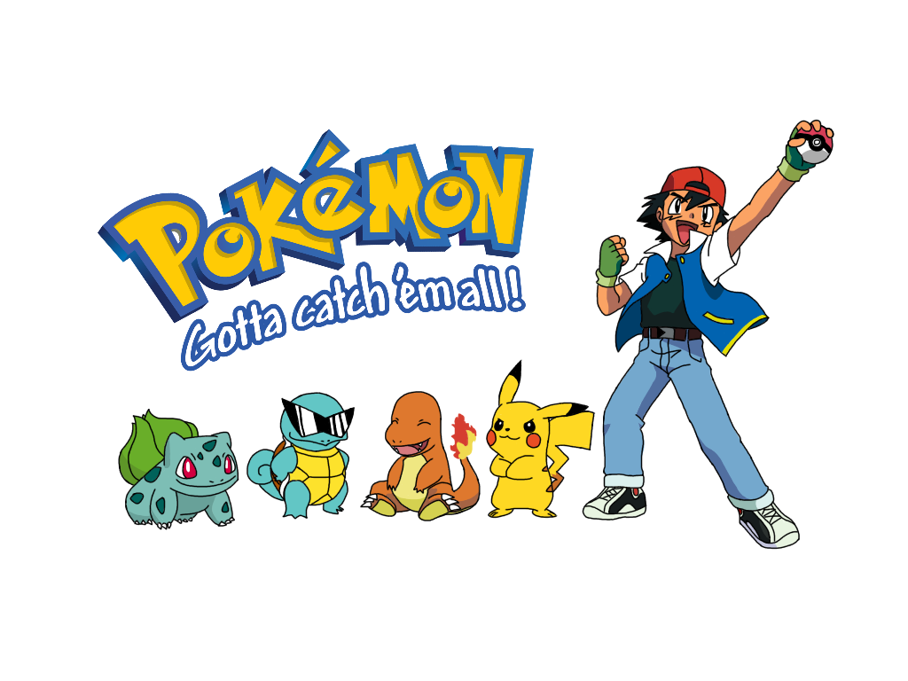

This "Catch 'em all" attitude-driven game was created to simulate the very basic functions of the famous Pokemon franchise. The user is able to discover different types of Pokemon that have varying combat power (CP) and health points (HP), as often recognized in Pokemon Go, and have a chance at "catching" the one on screen. The chances of success depend on the Pokemon, implemented as a `Java Object` which has various percentage rates. The user is also able to sort through a list of their "Caught" and "Seen" Pokemon, imitating a Pokedex. 

I was responsible for multiple components of this project. An example would be creating the "Catch" button which essentially generates some random Pokemon object (classes we wrote throughout the semester) and displays some information required on the screen. If the user were to "catch" the Pokemon, then it must be added to an iterative list that represents the user's "caught" Pokemon. There would also be a need to add the Pokemon to another list that represents the user's "seen" Pokemon. Since we also wanted to be able to display these objects in order of "evolution," the Pokemon cannot be added to a regular list. Instead, we created another class that would order these Pokemon in their respective order of evolution. We called this the "PokeTree" and we were able to display the Pokemon in chronological order or by order of evolution, despite when which Pokemon object was added.

This project allowed me to explore how object inheritance works and how we can create classes to solve issues such as implementing a specific sorted order. My partner and I used GitKraken as a way to easily and safely push up code which then allowed me to visualize the process of branch changes and collaborative coding.

Source: <a href="https://github.com/ICSatKCC/assignment-9-f21-final-project-gui-g5-ashley-and-michelle"><i class="large github icon "></i>GitHub repo for Pokemon GUI</a>
